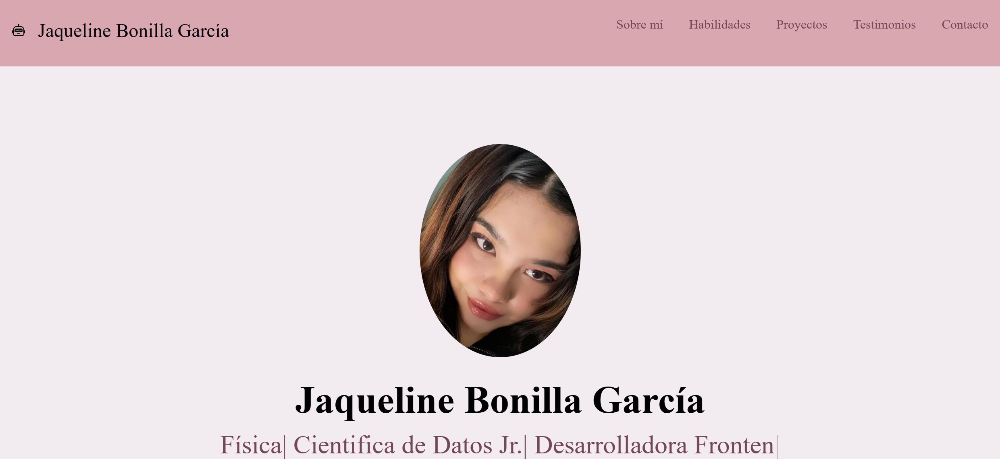
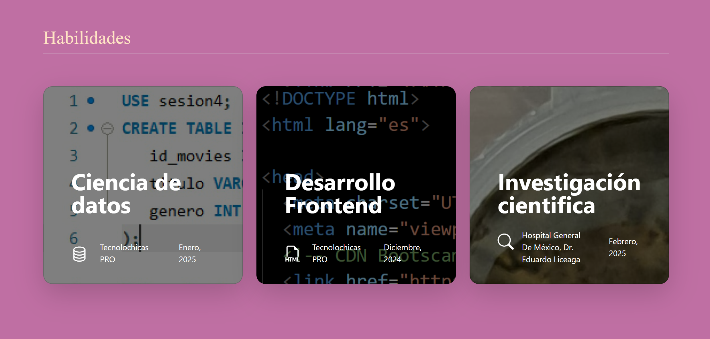
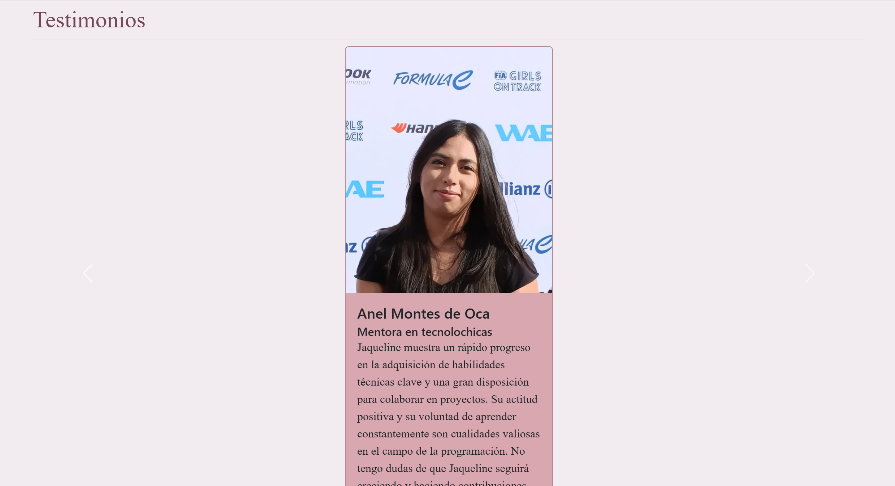
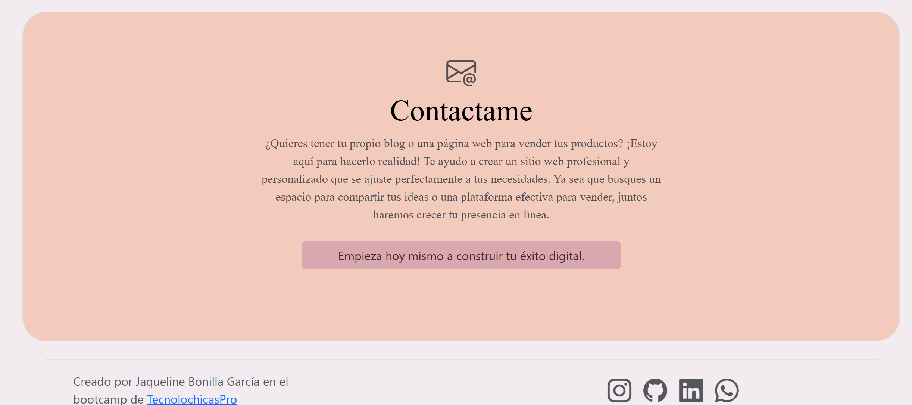

# Portafolio de Proyectos 

¡Hola! Soy Jaqueline Bonilla, soy Física. Apasionada por la tecnología, la ciencia de datos y el desarrollo Frontend. Aquí podrás encontrar más información sobre mí. 
_____

## El proyecto cuenta con las secciones de:  

- 🔨 Habilidades 
- 📋 Proyectos 
- 👨‍🦲 Testimonios
- 📱 Contacto

Creado con: 

- HTML 
- CSS
- JavaScript

### Vista Previa

    
    

### *¡Espero colaboremos pronto!*

## Mis redes sociales 

   
  

